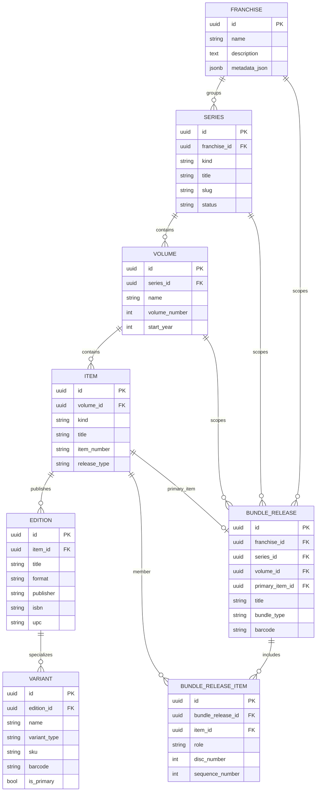

# Collectarr Core


> The shared metadata engine behind Collectarr — canonical catalog, provider integrations, image delivery, and admin console.

Core owns the shared catalog and provider infrastructure. Personal collection data (owned items, wishlists, grades, notes, personal tags) lives in `collectarr-app` and optionally syncs through `collectarr-sync`, while shared editorial tags can be attached to catalog series in Core.

## Features

- **Canonical media catalog** — series, volumes, items, editions, variants, releases, people, organizations, story arcs, characters, and shared series-level tags
- **10 metadata providers** — GCD, ComicVine, Hardcover, AniList, MangaDex, OpenLibrary, BGG, MusicBrainz, IGDB, TMDb
- **Smart provider search** — title normalization, issue matching, series aliases, barcode/UPC lookup
- **Story arc & character facets** — bulk facet endpoints for filtering items by arcs and characters
- **Typed metadata projection** — item, search, and admin preview responses expose normalized fields such as platforms, catalog numbers, and release status
- **Image pipeline** — external URLs by default, optional MinIO/S3 mirroring, MangaDex cover proxy, WebP normalization, LRU cache with budget tracking, and content-addressed origins for uploaded images
- **Full-text search** — optional Meilisearch indexing for instant catalog queries
- **Admin console** — provider health, ingest queues, catalog coverage, duplicate detection, user management, image cache stats, audit logs
- **Ingest job queue** — DB-backed provider ingest with automatic worker processing, retry, and status tracking
- **Role-based access** — viewer / editor / admin roles with audit trail
- **OpenAPI docs** — auto-generated schema at `/docs` with versioned export

## Database Schema

Below is the high-level canonical database map used by Core. It is intentionally split into two Mermaid diagrams so the README view stays readable on GitHub.

The source of truth remains `app/models/canonical.py`.

### Catalog Spine



### Editorial, Identity, and Operations

```mermaid
erDiagram
	ITEM {
		uuid id PK
		string title
		string kind
	}

	SERIES {
		uuid id PK
		string title
		string kind
	}

	STORY_ARC {
		uuid id PK
		string name
		string publisher
	}

	STORY_ARC_ITEM {
		uuid id PK
		uuid story_arc_id FK
		uuid item_id FK
		int ordinal
	}

	CHARACTER {
		uuid id PK
		string name
		uuid first_appearance_item_id FK
	}

	CHARACTER_APPEARANCE {
		uuid id PK
		uuid character_id FK
		uuid item_id FK
		string role
	}

	TAG {
		uuid id PK
		string kind
		string name
	}

	ENTITY_TAG {
		uuid id PK
		string entity_type
		uuid entity_id
		uuid tag_id FK
	}

	PERSON {
		uuid id PK
		string name
	}

	ENTITY_PERSON {
		uuid id PK
		string entity_type
		uuid entity_id
		uuid person_id FK
		string role
	}

	ORGANIZATION {
		uuid id PK
		string name
		string type
	}

	ENTITY_ORGANIZATION {
		uuid id PK
		string entity_type
		uuid entity_id
		uuid organization_id FK
		string role
	}

	SERIES_RELATION {
		uuid id PK
		uuid source_series_id FK
		uuid target_series_id FK
		string relation_type
	}

	EXTERNAL_PROVIDER_ID {
		uuid id PK
		string provider
		string provider_item_id
		string entity_type
		uuid entity_id
	}

	IMAGE_ASSET {
		uuid id PK
		string entity_type
		uuid entity_id
		string image_type
		string provider
	}

	IMAGE_CACHE_ENTRY {
		uuid id PK
		string provider
		string provider_item_id
		string source_url
		string object_key
	}

	PROVIDER_INGEST_JOB {
		uuid id PK
		string provider
		string provider_item_id
		string status
		uuid item_id
	}

	METADATA_PROPOSAL {
		uuid id PK
		string provider
		string provider_item_id
		string query
		string status
	}

	ADMIN_AUDIT_LOG {
		uuid id PK
		string action
		string entity_type
		uuid entity_id
		string actor_email
	}

	STORY_ARC ||--o{ STORY_ARC_ITEM : maps
	ITEM ||--o{ STORY_ARC_ITEM : belongs_to

	CHARACTER ||--o{ CHARACTER_APPEARANCE : maps
	ITEM ||--o{ CHARACTER_APPEARANCE : has
	ITEM ||--o| CHARACTER : first_appearance

	TAG ||--o{ ENTITY_TAG : assigns
	PERSON ||--o{ ENTITY_PERSON : assigns
	ORGANIZATION ||--o{ ENTITY_ORGANIZATION : assigns

	SERIES ||--o{ SERIES_RELATION : source
	SERIES ||--o{ SERIES_RELATION : target

	ITEM ||--o{ PROVIDER_INGEST_JOB : ingest_target
```



- `entity_tags`, `entity_persons`, `entity_organizations`, `external_provider_ids`, and `image_assets` are polymorphic link tables: they store `entity_type` + `entity_id` so the same support table can attach to multiple catalog entity types.
- `image_cache_entries`, `provider_ingest_jobs`, `metadata_proposals`, and `admin_audit_logs` are operational tables around ingestion, caching, and moderation workflows.
- If you want a fuller pan/zoom-first version later, the next good step would be exporting the same schema to a dedicated ERD page or `dbdiagram` file, but the Mermaid version above renders directly in GitHub.

## Quick Start

```powershell
Copy-Item .env.example .env
docker compose up --build -d
docker compose exec api alembic upgrade head
docker compose exec api python -m app.scripts.seed_comics
```

## Development

```powershell
python -m pip install -e .[dev]
python -m ruff check .
python -m pytest
```

Helper commands:

```powershell
.\tools\dev.ps1 start          # Start Docker stack
.\tools\dev.ps1 start -WithSync # Start Core + collectarr-sync dev stack
.\tools\dev.ps1 migrate        # Run Alembic migrations
.\tools\dev.ps1 seed           # Seed sample comics data
.\tools\dev.ps1 test           # Run test suite
.\tools\dev.ps1 check          # Lint + type check
.\tools\dev.ps1 smoke-providers # Smoke test all providers
.\tools\dev.ps1 reset-stack    # Clean reset of all containers
python -m scripts.export_provider_support  # Regenerate docs/provider-support.md from the provider registry
```

## Extending Metadata For New Libraries

Core is the canonical source of cross-library metadata. When a provider exposes a
new field, wire it through the normalized metadata contract first and only then
project it into the client.

1. Normalize the field in the provider ingest pipeline.
2. Expose it through the public schemas used by the app: item responses, search results, and admin/provider previews.
3. Add it to Meilisearch documents and display attributes when it should participate in search or search previews.
4. Keep field names stable so `collectarr-app` can cache and render the same canonical shape offline.

When normalizing provider data, preserve the provider-native raw payload exactly
as returned upstream. If a workflow also needs the canonical provider item id,
use `ProviderItem.provider_item_id` alongside the raw mapping instead of
rewriting `raw['id']`, because some providers expose numeric or kind-specific
raw identifiers that are not interchangeable with the canonical route id.

This keeps provider growth and future library additions predictable: new kinds
can share the same catalog/search/admin contract instead of inventing parallel
app-only fields.

## Local URLs

| Service | URL |
|---------|-----|
| API | http://localhost:8010 |
| API docs (Swagger) | http://localhost:8010/docs |
| Admin Console | http://localhost:8010/admin/ui |
| Sync service | http://localhost:8020 |
| Meilisearch | http://localhost:7700 |
| MinIO console | http://localhost:9001 |

## Release Policy

Release publishing is manual-only. The `Release` GitHub Actions workflow uses
`workflow_dispatch`; pushing to `main` runs CI only — no auto-publish.

When a releasable version is detected, the workflow publishes a GitHub Release
and pushes the backend container image to `ghcr.io/collectarr/collectarr-core`
with both the semantic version tag and `latest`.

The first published GHCR package defaults to `private`. After the first real
release, open the package page in the `collectarr` organization and switch
`collectarr-core` to `public` before expecting anonymous `docker pull`
operations to work:

- `https://github.com/orgs/collectarr/packages/container/package/collectarr-core`

For personal LAN deployment on unRAID with Docker Compose, see
[docs/unraid.md](docs/unraid.md).

## Catalog Badges

The repo includes snapshot badges for total catalog items and per-kind item
counts. `.github/workflows/catalog-badges.yml` refreshes them on a daily
schedule or manual dispatch.

To switch from placeholder badges to live counts, configure:

- `COLLECTARR_BADGES_BASE_URL` — public base URL for the hosted Core server
- `COLLECTARR_BADGES_TOKEN` — bearer token for `/admin/catalog/summary`

Or, instead of a static token:

- `COLLECTARR_BADGES_EMAIL`
- `COLLECTARR_BADGES_PASSWORD`

The workflow logs in through `/auth/login` when a bearer token is not provided.

## Related Repos

| Repo | Purpose |
|------|---------|
| `collectarr-app` | Flutter client (web, Windows, Android) |
| `collectarr-sync` | Optional personal sync service |

## Provider Support

See [docs/provider-support.md](docs/provider-support.md) for the generated
support matrix derived from the provider registry.

## Roadmap

See [docs/implementation-plan.md](docs/implementation-plan.md) for the full roadmap.
